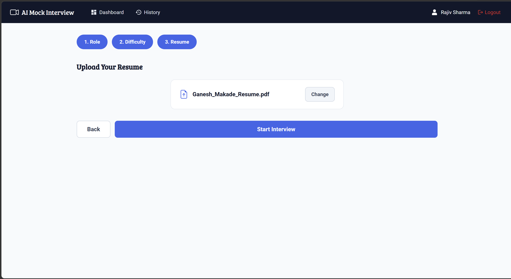
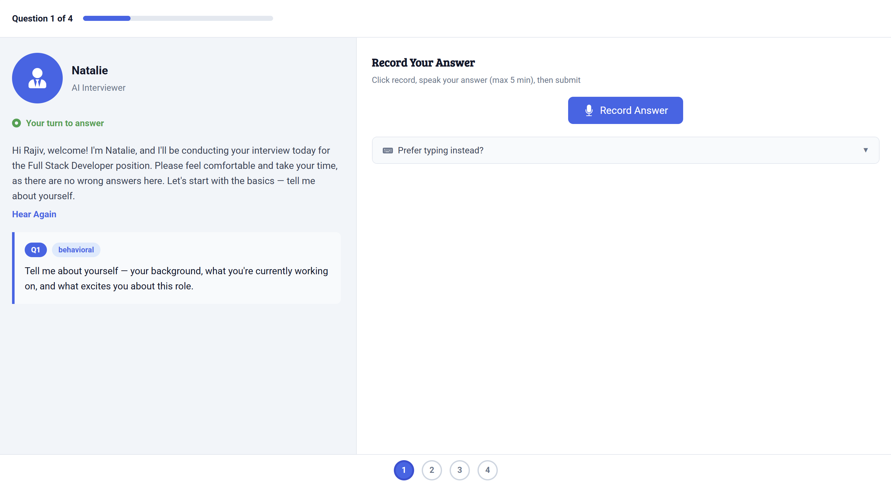
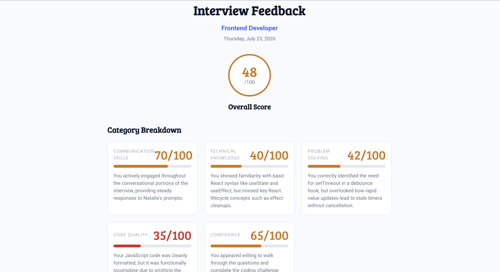

[](#license)
# 🎤 AI-Powered Mock Interview Platform

> Practice technical interviews with an AI interviewer — voice-based Q&A, live coding challenges, and instant, detailed feedback. Available 24/7, tailored to your resume.


🔗 **Live Demo:** [https://ai-powered-mock-interview-platform-alpha.vercel.app]
📽️ **Demo Video / GIF:** [Add a Loom or YouTube walkthrough link here]

---

## 📸 Preview

<!-- Replace with actual screenshots or a GIF walkthrough of the app -->
| Resume Upload | Live Interview | Feedback Report |
|---|---|---|
|  |  |  |

---

## 💡 The Problem

You can solve coding problems at home. You can explain React hooks to a friend. But the moment a real interviewer says *"Tell me about yourself,"* your mind goes blank.

**Knowing answers ≠ performing under pressure.** Watching Virat Kohli bat on TV won't help you hit a six — you have to face the ball yourself. The same is true for interviews: reading about system design isn't the same as explaining it live to a senior engineer.

Existing options fall short:

| Approach | Limitation |
|---|---|
| Practice with friends | May not ask industry-relevant questions |
| Watch YouTube | You're not actually speaking |
| Read Q&A lists | Memorizing ≠ explaining under pressure |
| Paid mock interviews | Expensive and limited availability |

## 🚀 The Solution

An AI interviewer, available anytime, that:
- Asks role-specific, resume-personalized questions
- Listens to your verbal answers via voice
- Evaluates your live code submissions
- Gives instant, structured feedback across multiple dimensions

No scheduling, no waiting, no cost per session — just open the browser and practice.

---

## ✨ Key Features

| Feature | Description |
|---|---|
| 📄 **Resume-Based Questions** | AI parses your resume and generates personalized interview questions |
| 🎙️ **Voice Interviews** | AI interviewer ("Natalie") asks questions via TTS; you respond by voice |
| 💻 **Live Coding** | Built-in Monaco code editor for real-time coding challenges |
| 📊 **AI Scoring** | Detailed feedback across 5 evaluation categories |
| 🕘 **Interview History** | Track every past interview with scores and feedback |
| 🧑‍💻 **Multi-Role Support** | Frontend, Backend, Full Stack, Data Analyst, DevOps, and more |

---

## 🏗️ Tech Stack

**Frontend**
- React
- Monaco Editor (live coding)

**Backend**
- Node.js / Express
- MongoDB Atlas (database)

**AI & Voice**
- Google Gemini — question generation & feedback scoring
- Murf AI — text-to-speech (AI interviewer voice)
- AssemblyAI — speech-to-text (answer transcription)

---

## 🧠 How It Works

1. **Resume Upload & Setup** — Upload a PDF resume, choose role and interview type, and configure settings.
2. **AI Interview** — Voice-based Q&A with contextual follow-up questions, plus live coding rounds when applicable.
3. **Feedback & History** — AI generates a detailed performance report immediately after; all past interviews and scores are saved and viewable anytime.

---

## 📂 Project Structure

```
                           👤 User
                             │
                             ▼
                    React Frontend 
                             │
        ┌────────────────────┼────────────────────┐
        │                    │                    │
        ▼                    ▼                    ▼
 Resume Upload        Voice Interaction      Live Coding
                             │
                             ▼
                 Express.js Backend 
                             │
      ┌──────────────┬───────────────┬───────────────┐
      │              │               │               │
      ▼              ▼               ▼               ▼
 MongoDB Atlas   Google Gemini    Murf AI     AssemblyAI
(Database)       (Questions &     (Text-to-   (Speech-to-
                 Feedback)        Speech)     Text)

---

## ⚙️ Getting Started

### Prerequisites
- [VS Code](https://code.visualstudio.com/)
- [Node.js](https://nodejs.org/)
- [MongoDB Atlas](https://www.mongodb.com/atlas) account
- API keys for:
  - [Google Gemini](https://ai.google.dev/)
  - [Murf AI](https://murf.ai/)
  - [AssemblyAI](https://www.assemblyai.com/)

### Installation

```bash
# Clone the repository
git clone  https://github.com/ganeshmakade-59/AI-Powered-Mock-Interview-Platform.git
cd AI-Powered-Mock-Interview-Platform

# Install backend dependencies
cd server
npm install

# Install frontend dependencies
cd ../client
npm install
```

### Environment Variables

Create a `.env` file inside `server/` with the following:

```env
MONGODB_URI=your_mongodb_atlas_connection_string
GEMINI_API_KEY=your_google_gemini_api_key
MURF_API_KEY=your_murf_ai_api_key
ASSEMBLYAI_API_KEY=your_assemblyai_api_key
PORT=5000
```

### Run Locally

```bash
# Start backend
cd server
npm run dev

# Start frontend (in a new terminal)
cd client
npm run dev
```

The app should now be running at `http://localhost:3000` (frontend) and `http://localhost:5000` (backend API).

---

## 🗺️ Roadmap

- [ ] Add support for group/panel-style mock interviews
- [ ] Add downloadable PDF feedback reports
- [ ] Add more roles (ML Engineer, Product Manager, QA)
- [ ] Deploy publicly with demo accounts

---

## 🤝 Contributing

Contributions, issues, and feature requests are welcome!
Feel free to check the [issues page](https://github.com/<your-username>/<your-repo-name>/issues) or open a pull request.

1. Fork the project
2. Create your feature branch (`git checkout -b feature/amazing-feature`)
3. Commit your changes (`git commit -m 'Add amazing feature'`)
4. Push to the branch (`git push origin feature/amazing-feature`)
5. Open a Pull Request

---

## 📜 License

This project is licensed under the MIT License — see the [LICENSE](./LICENSE) file for details.

---

## 👤 Author

**[Your Name]**
- Portfolio: [https://github.com/ganeshmakade-59]
- LinkedIn: [https://www.linkedin.com/in/ganesh-makade/]
- Email: [your-email]

---

## 🌍 Similar Real-World Platforms (Inspiration)

- [Pramp](https://pramp.com)
- [InterviewBuddy](https://interviewbuddy.in)
- [Google Interview Warmup](https://grow.google/certificates/interview-warmup)

---

⭐ If you found this project interesting, consider giving it a star — it helps a lot!
